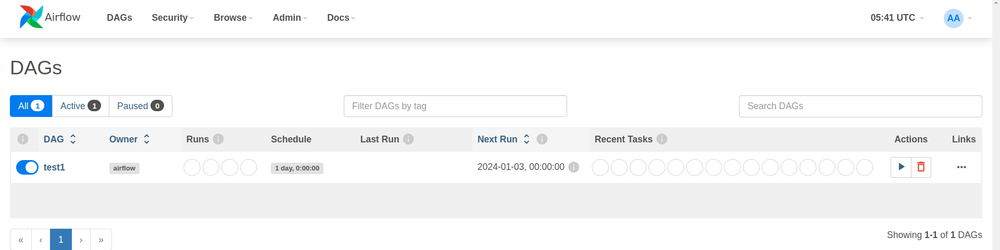
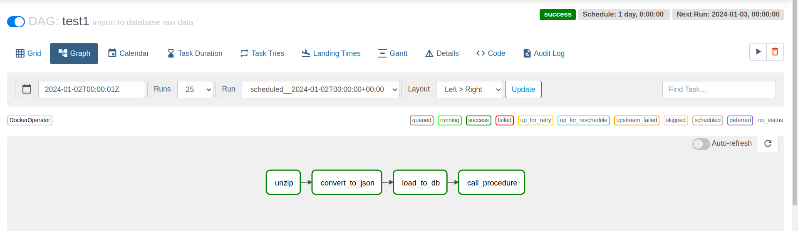
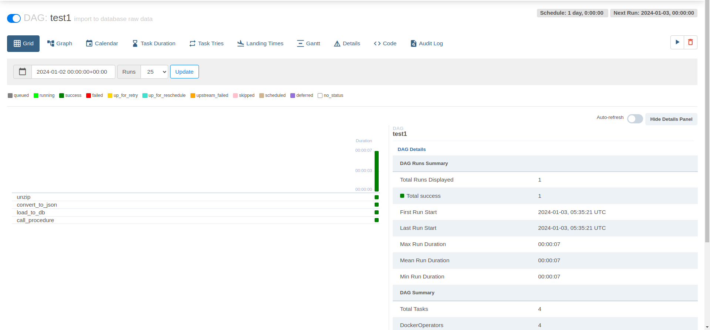
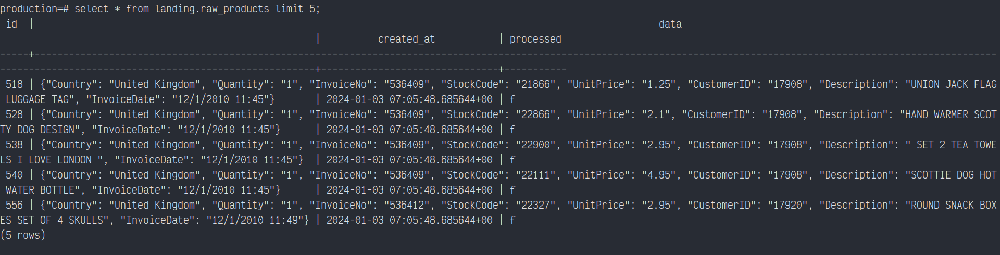
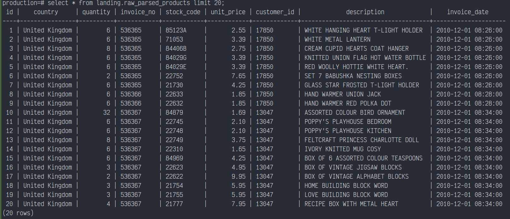
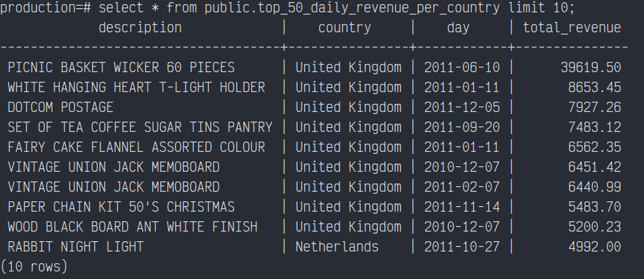
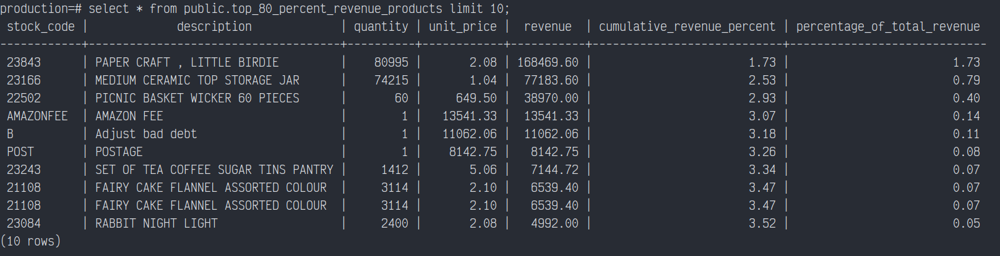
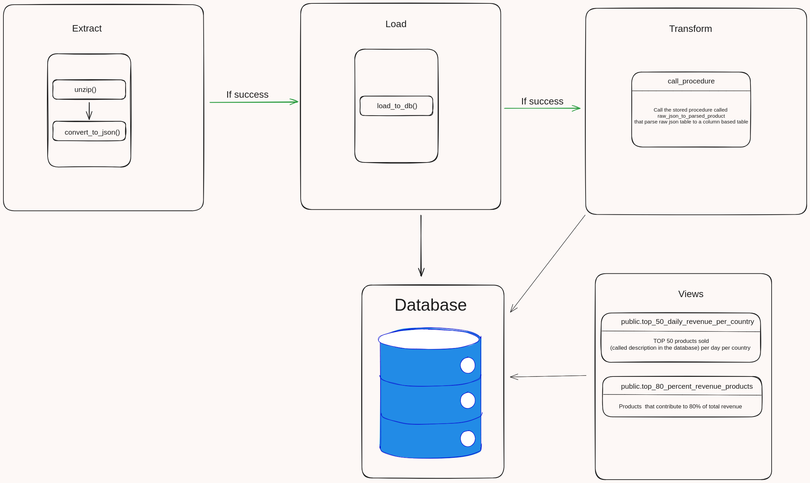

# Installation

## Prerequisites

The only needed dependency is Docker.

### Install Docker

If you don't have Docker installed, you can follow the official Docker installation guide for your operating system.

# Airflow

This branch is using airflow to run the pipeline

the dag configuration is in `./airflow/dags/scripts_docker.py`

You can run it using this command

```
cd ./airflow
docker compose up
```

then go to localhost:8080.

## Configuration

Since the dag is running its tasks using `dockerOperator` you need to expose your docker socket to the container,
you can do it by setting a volume in the `docker_compose.yml` :

```
x-airflow-common:
  volumes:
      - /var/run/docker.sock:/var/run/docker.sock
```

You can see the dag here :  


you can also access the dag's graph to see what tasks are inside it:  


or the grid for more metadata:  


# Connect to the database

Once you ran the pipeline you can access the database directly from your computer at port `5433` or you can execute in a new terminal `psql` directly in the database container to query what you want,  
(it will prompt for a password , the default password is `pwd`)  
just run this :

```

docker exec -it airflow-db-1 psql -h localhost -U user -d production -W

```

You can find all queries in `./database/queries/`  
`raw_products`



`raw_parsed_products`



`top_50_daily_revenue_per_country`



`top_80_percent_revenue_products`



# Explanations

## Basic overview

Except for the views, each part involves Python scripts that can be executed together using poetry run pipeline.  
The process runs consecutively, but individual steps can be executed independently by running the corresponding file.
Each process have error handling and will throw exception if something fail which will stop the pipeline.

- `unzip()`  
  Unzip the input zip file to csv

- `convert_to_json()`  
  Convert the csv file to a json format

- `load_to_db()`  
  Load the json file to the database

- `call_procedure()`  
  Call the procedure called `raw_json_to_parsed_product()` that handle the json in `landing.raw_products` and extract it to `landing.raw_parsed_products`

- Views  
   Views are created at the database initialization and can be found in `./database/queries`  
   `public.top_50_daily_revenue_per_country` and `public.top_80_percent_revenue_products`



## CSV input

I got this csv from [Kaggle](https://www.kaggle.com/code/sinaasappel/ecommerce-data-exploration-and-visualization/input)  
It has duplicates and 536365 lines so i was thinking it would be a good example .

The content is as following :

| Column      | Type      | Example                              |
| ----------- | --------- | ------------------------------------ |
| InvoiceNo   | VARCHAR   | "536365"                             |
| StockCode   | VARCHAR   | "85123A"                             |
| Description | VARCHAR   | "WHITE HANGING HEART T-LIGHT HOLDER" |
| Quantity    | INTEGER   | 6                                    |
| InvoiceDate | TIMESTAMP | "12/1/2010 8:26"                     |
| UnitPrice   | DECIMAL   | 2.55                                 |
| CustomerID  | INTEGER   | 17850                                |
| Country     | VARCHAR   | "United Kingdom"                     |

## Duplicates handling

I handled duplicates using the following:

- I set a superkey constraint to the columns : `invoice_date`, `description`, `quantity`, `invoice_no`
- the raw json table has a `processed` column that is set to true when processed to avoid reprocessing it.

## JSON Processing

For the part that process the raw json table to a column based table is done using a stored procedure, you can run this procedure directly using a trigger or a cron (`pg_cron`)
but here i decided to run it using a python script that run `CALL name of the procedure` because i assume that we are using a DAG system  
So it will be a lot easier to track any step throught a DAG than directly in the database.

## Environment

In the context of a production pipeline we would use :

- environment variable
- secret file
- github secrets
- ...

Here for the sake of simplicity i just wrote it directly in the corresponding Dockerfiles.

## Potential upgrade in the future

- Use DBT for the whole pipeline.
